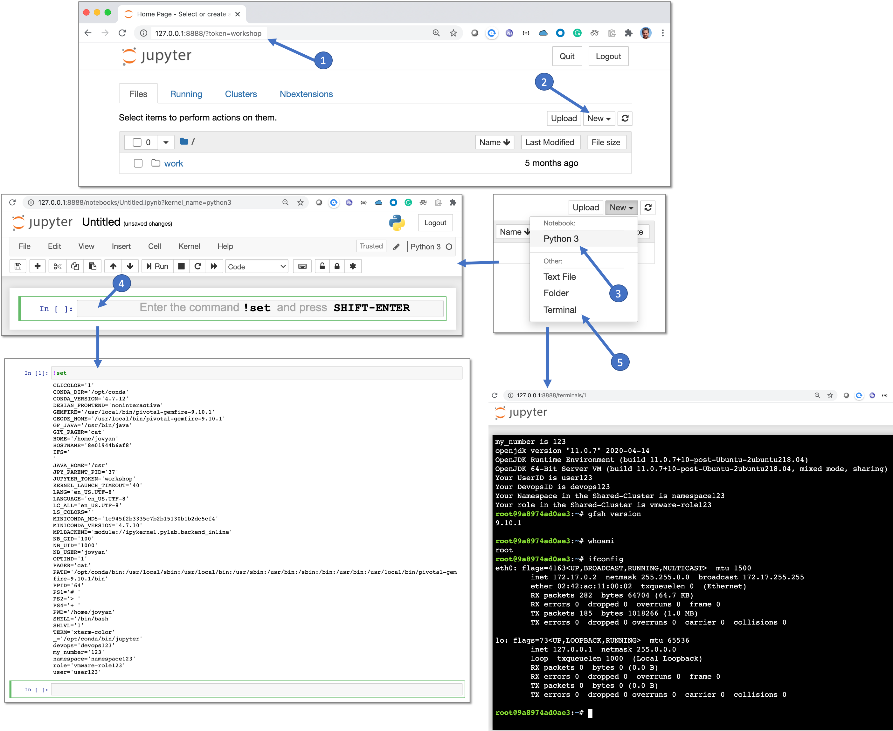

# TL;DR Let me just run the Jupyter Notebook

- If you just want to run this Jupyter Notebook App image, skip to Step 5

# Steps taken to create the [Tanzu-Jupyter-Notebook](https://hub.docker.com/repository/docker/rmeira/tanzu-jupyter-notebook) Docker Image

- My plan is to create a Docker Image of a Jupyter Notebook App that can be used during [Tanzu](https://tanzu.vmware.com/tanzu) Demos and Workshops.
- The idea is to have Workshop Attendees use a Web Interface to a Jupyter Notebook Terminal Window or to a Jupyter Notebook for the execution of Lab commands.
- My goal is to use this image not just from my MacBook but also to run Jupyter Notebooks in K8s Clusters.
- The [Tanzu-Jupyter-Notebook](https://hub.docker.com/repository/docker/rmeira/tanzu-jupyter-notebook) Docker Image will contain all the necessary CLIs and Packages to access TKGI (PKS) Kubernetes Clusters.
- Please take a look at the Dockerfile below to see exactly what modules and packages were added to the base image [jupyter/base-notebook:python-3.7.3](https://jupyter-docker-stacks.readthedocs.io/en/latest/)
- I added [nbextensions](https://jupyter-contrib-nbextensions.readthedocs.io/en/latest/install.html) to allow for the freezing or locking of cells. The respective icons will be on the Jupyter Notebook App as soon as you start it.

## Prerequisites

- I'm using a MacBook
- I have Docker v19.03.8 installed on my MacBook
- I'm using [ZSH](https://ohmyz.sh/)  (n.b. not a requirement)
- My Mac home directory for my Jupyter Notebook is `/work/jupyter-notebook`
- I executed the following commands on my Mac before proceeding with the next steps.

```
python3 -m pip install notebook zsh_jupyter_kernel
python3 -m zsh_jupyter_kernel.install --sys-prefix
docker system prune -a -f
```

## Change Log

- 06-25-2020: Created release 1.7 of rmeira/tanzu-jupyter-notebook
  - Updated Dockerfile to use/include: Pivnet  1.0.4, dotnet-sdk-3.1,  gemfire 9.10.1, helm 3.2.4, and docker 19.03.9
             
- 06-27-2020: Created releases 1.8 and 1.9 while working towards the goal of being able to:
  - run Gemfire's gfsh CLI and other CLI commands from a Jupyter Notebook (i.e. without  the need for a Jupyter Notebook Terminal window)
  - define additional environment variables such as `$devops` and `$user` which will be available to Jupyter Notebook and Jupyter Notebook Terminal users.
  -  run `.bashrc` whenever a Jupyter Notebook is started by by-passing the Dockerfile's CMD [ "jupyter", "notebook","--allow-root"] command-line
     - this is achieved by providing the commands `/bin/bash /home/jovyan/.bashrc` when starting this Docker image
     - and by tweaking the contents of `.bashrc` so it will execute its contents when the a new session is not interactive in nature
     - and by adding code at the end of `.bashrc` to execute  `/opt/conda/bin/jupyter notebook --allow-root` when the session is not interactive

- 06-28-2020: Created release 1.10:
  - placed Gemfire in /usr/local/bin and update environment variables
  - documented the changes

## Step 1 - Working from my MacBook's `/home/jupyter-notebook` directory

- Before you copy and paste the contents of `Dockerfile` shown below, please make sure you have a valid `Pivnet API Token` from `https://network.pivotal.io  > Profile > Request Token` and that you update the `Dockerfile's` reference to said API Token accordingly.

```
mkdir -p  /work/jupyter-notebook
cd /work/jupyter-notebook
```

- I created the following `Dockerfile`. 
- Here's the output from the command: `cat /work/jupyter-notebook/Dockerfile`

```
FROM jupyter/base-notebook:python-3.7.3

USER root

RUN apt-get update && apt-get install -y --no-install-recommends apt-utils

RUN apt-get install --quiet --assume-yes --no-install-recommends zsh git python3-pip 
RUN sh -c "$(wget -O- https://raw.githubusercontent.com/ohmyzsh/ohmyzsh/master/tools/install.sh)"

RUN apt-get update && apt-get install -y wget unzip jq git golang-go python3 vim expect net-tools maven
RUN apt-get install -y apt-transport-https ca-certificates curl gnupg-agent software-properties-common
RUN curl -fsSL https://download.docker.com/linux/debian/gpg | apt-key add -

RUN apt-get install -y ssh

RUN wget https://github.com/pivotal-cf/pivnet-cli/releases/download/v1.0.4/pivnet-linux-amd64-1.0.4 && \
    mv pivnet-linux-amd64-1.0.4 /usr/local/bin/pivnet && \
    chmod +x /usr/local/bin/pivnet

RUN wget https://packages.microsoft.com/config/ubuntu/20.04/packages-microsoft-prod.deb -O packages-microsoft-prod.deb && \
    sudo dpkg -i packages-microsoft-prod.deb

RUN sudo apt-get update; \
    sudo apt-get install -y apt-transport-https && \
    sudo apt-get update && \
    sudo apt-get install -y dotnet-sdk-3.1

# IMPORTANT -- USE A VALID API-TOKEN FROM https://network.pivotal.io > Sign-in > Edit Profile > Request New Refresh Token

RUN pivnet login --api-token='f55dee4fd7e54cd0991813d30e052c29-r'

RUN pivnet download-product-files --product-slug='pivotal-container-service' --release-version='1.7.0' --product-file-id=646536 && \
    mv pks-linux-amd64* /usr/local/bin/pks && \
    chmod +x /usr/local/bin/pks

RUN pivnet download-product-files --product-slug='pivotal-container-service' --release-version='1.7.0' --product-file-id=633728 && \
    mv kubectl-linux-amd64* /usr/local/bin/kubectl && \
    chmod +x /usr/local/bin/kubectl 

RUN pivnet download-product-files --product-slug='elastic-runtime' --release-version='2.8.6' --product-file-id=625350 && \
    unzip cf-cli*.zip && \
    tar -xvf cf-cli_6.50.0_linux_x86-64.tgz && \
    mv cf /usr/local/bin/cf && \
    chmod +x /usr/local/bin/cf && \
    rm cf-cli* && \
    rm LICENSE NOTICE && \
    rm -rf ~/.cf

RUN pivnet download-product-files --product-slug='pivotal-gemfire' --release-version='9.10.1' --product-file-id=691996 && \
    tar -xzvf pivotal-gemfire-9.10.1.tgz && \
    rm pivotal-gemfire-9.10.1.tgz && \
    cp -a /home/jovyan/pivotal-gemfire-9.10.1  /usr/local/bin  && \
    rm -rf /home/jovyan/pivotal-gemfire-9.10.1

RUN wget https://get.helm.sh/helm-v3.2.4-linux-amd64.tar.gz && \
    tar -zxvf helm-v3.2.4-linux-amd64.tar.gz && \
    mv linux-amd64/helm /usr/local/bin/helm && \
    chmod +x /usr/local/bin/helm && \
    rm helm-v3.2.4-linux-amd64.tar.gz && \
    rm -rf linux-amd64

RUN wget https://download.docker.com/linux/static/stable/x86_64/docker-19.03.9.tgz && \
    tar xzvf docker-19.03.9.tgz && \
    cp docker/* /usr/bin/ && \
    rm -rf docker*

RUN rm /home/jovyan/packages-microsoft-prod.deb

RUN usermod -aG sudo jovyan

RUN chown -R root:root /home/jovyan/

RUN easy_install pip

RUN pip install wheel && \
    pip install pyzmq==18.1.1 && \
    pip install zsh-jupyter-kernel && \
    pip install jupyter_contrib_nbextensions

RUN jupyter contrib nbextension install --system

RUN jupyter nbextension enable freeze/main

RUN pip install tornado

CMD [ "jupyter", "notebook", "--allow-root" ]
```

## Step 2 - Building this Docker Image and placing it in Docker Hub

- I executed the following command on my MacBook (note: the dot in the command below, is important):
```
docker build --tag zsh-jupyter-kernel:3.2 .
```
- The command shown above does take a few minutes to execute.
- The output from the `docker images` command was:

```
REPOSITORY              TAG                 IMAGE ID            CREATED             SIZE
zsh-jupyter-kernel      3.2                 fa9ec4c939ed        16 seconds ago      2.58GB
jupyter/base-notebook   python-3.7.3        ecc5558ab3a4        5 months ago        590MB
```

- I was then able to start my first Jupyter Notebook App locally from my MacBook:

```
docker run -v /var/run/docker.sock:/var/run/docker.sock --privileged -p 8888:8888 --env JUPYTER_TOKEN=workshop --name=zsh-jupyter-kernel zsh-jupyter-kernel:3.2
```

- The logs on my terminal window looked like this:

```
[I 19:47:21.818 NotebookApp] Writing notebook server cookie secret to /home/jovyan/.local/share/jupyter/runtime/notebook_cookie_secret
[I 19:47:22.051 NotebookApp] [jupyter_nbextensions_configurator] enabled 0.4.1
[I 19:47:22.556 NotebookApp] JupyterLab extension loaded from /opt/conda/lib/python3.7/site-packages/jupyterlab
[I 19:47:22.556 NotebookApp] JupyterLab application directory is /opt/conda/share/jupyter/lab
[I 19:47:22.863 NotebookApp] Serving notebooks from local directory: /home/jovyan
[I 19:47:22.863 NotebookApp] The Jupyter Notebook is running at:
[I 19:47:22.863 NotebookApp] http://750f3a81bc75:8888/?token=...
[I 19:47:22.863 NotebookApp]  or http://127.0.0.1:8888/?token=...
[I 19:47:22.863 NotebookApp] Use Control-C to stop this server and shut down all kernels (twice to skip confirmation).
```

- But, I did not go to `http://127.0.0.1:8888/?token=xyz` just yet because we need to tweak this image from the inside out.


## Step 3 - Adding a few extra touches to my Docker Image of the Jupyter Notebook App:

- I left the Terminal Window opened in the section above (on my Mac) running and opened a separate/new Terminal Window.
- Using the new Terminal Window on my Mac, I entered the running Docker Container using: 

```
docker exec -it -u root zsh-jupyter-kernel bash
```

- I then proceeded with the following commands:

```
root@dccc68cf42f7:~# passwd jovyan
Enter new UNIX password: jovyan
Retype new UNIX password: jovyan
passwd: password updated successfully
```
- I then used `vi` to override the contents of `/home/jovyan/.bashrc` with the contents of the script shown below:

```
# ~/.bashrc: executed by bash(1) for non-login shells.
# see /usr/share/doc/bash/examples/startup-files (in the package bash-doc)
# for examples

# If not running interactively, don't do anything
# Changed by rmeira to: run .bashrc in any case
# case $- in
#     *i*) ;;
#       *) return;;
# esac

# don't put duplicate lines or lines starting with space in the history.
# See bash(1) for more options
HISTCONTROL=ignoreboth

# append to the history file, don't overwrite it
shopt -s histappend

# for setting history length see HISTSIZE and HISTFILESIZE in bash(1)
HISTSIZE=1000
HISTFILESIZE=2000

# check the window size after each command and, if necessary,
# update the values of LINES and COLUMNS.
shopt -s checkwinsize

# If set, the pattern "**" used in a pathname expansion context will
# match all files and zero or more directories and subdirectories.
#shopt -s globstar

# make less more friendly for non-text input files, see lesspipe(1)
[ -x /usr/bin/lesspipe ] && eval "$(SHELL=/bin/sh lesspipe)"

# set variable identifying the chroot you work in (used in the prompt below)
if [ -z "${debian_chroot:-}" ] && [ -r /etc/debian_chroot ]; then
    debian_chroot=$(cat /etc/debian_chroot)
fi

# set a fancy prompt (non-color, unless we know we "want" color)
case "$TERM" in
    xterm-color|*-256color) color_prompt=yes;;
esac

# uncomment for a colored prompt, if the terminal has the capability; turned
# off by default to not distract the user: the focus in a terminal window
# should be on the output of commands, not on the prompt
force_color_prompt=yes

if [ -n "$force_color_prompt" ]; then
    if [ -x /usr/bin/tput ] && tput setaf 1 >&/dev/null; then
    # We have color support; assume it's compliant with Ecma-48
    # (ISO/IEC-6429). (Lack of such support is extremely rare, and such
    # a case would tend to support setf rather than setaf.)
    color_prompt=yes
    else
    color_prompt=
    fi
fi

if [ "$color_prompt" = yes ]; then
    PS1='${debian_chroot:+($debian_chroot)}\[\033[01;32m\]\u@\h\[\033[00m\]:\[\033[01;34m\]\w\[\033[00m\]\$ '
else
    PS1='${debian_chroot:+($debian_chroot)}\u@\h:\w\$ '
fi
unset color_prompt force_color_prompt

# If this is an xterm set the title to user@host:dir
case "$TERM" in
xterm*|rxvt*)
    PS1="\[\e]0;${debian_chroot:+($debian_chroot)}\u@\h: \w\a\]$PS1"
    ;;
*)
    ;;
esac

# enable color support of ls and also add handy aliases
if [ -x /usr/bin/dircolors ]; then
    test -r ~/.dircolors && eval "$(dircolors -b ~/.dircolors)" || eval "$(dircolors -b)"
    alias ls='ls --color=auto'
    #alias dir='dir --color=auto'
    #alias vdir='vdir --color=auto'

    alias grep='grep --color=auto'
    alias fgrep='fgrep --color=auto'
    alias egrep='egrep --color=auto'
fi

# colored GCC warnings and errors
#export GCC_COLORS='error=01;31:warning=01;35:note=01;36:caret=01;32:locus=01:quote=01'

# some more ls aliases
alias ll='ls -alF'
alias la='ls -A'
alias l='ls -CF'

# Add an "alert" alias for long running commands.  Use like so:
#   sleep 10; alert
alias alert='notify-send --urgency=low -i "$([ $? = 0 ] && echo terminal || echo error)" "$(history|tail -n1|sed -e '\''s/^\s*[0-9]\+\s*//;s/[;&|]\s*alert$//'\'')"'

# Alias definitions.
# You may want to put all your additions into a separate file like
# ~/.bash_aliases, instead of adding them here directly.
# See /usr/share/doc/bash-doc/examples in the bash-doc package.

if [ -f ~/.bash_aliases ]; then
    . ~/.bash_aliases
fi

# enable programmable completion features (you don't need to enable
# this, if it's already enabled in /etc/bash.bashrc and /etc/profile
# sources /etc/bash.bashrc).
if ! shopt -oq posix; then
  if [ -f /usr/share/bash-completion/bash_completion ]; then
    . /usr/share/bash-completion/bash_completion
  elif [ -f /etc/bash_completion ]; then
    . /etc/bash_completion
  fi
fi

# if there's a my_number environment variable, it will be used
# if there's a /home/jovyan/my_number file, it's contents will be used to set my_number

if [ -f '/home/jovyan/my_number' ]; then my_number=$(cat /home/jovyan/my_number); fi

echo "my_number is $my_number"

source <(kubectl completion bash)
export user=user$my_number
export devops=devops$my_number
export role=vmware-role$my_number
export namespace=namespace$my_number
export JAVA_HOME=/usr

$JAVA_HOME/bin/java -version
echo "Your UserID is $user"
echo "Your DevopsID is $devops"
echo "Your Namespace in the Shared-Cluster is $namespace"
echo "Your role in the Shared-Cluster is $role"

GEMFIRE=/usr/local/bin/pivotal-gemfire-9.10.1
GEODE_HOME=/usr/local/bin/pivotal-gemfire-9.10.1
export GEMFIRE
export GEODE_HOME

GF_JAVA=$JAVA_HOME/bin/java
export GF_JAVA

PATH=$PATH:$JAVA_HOME/bin:/usr/local/bin/pivotal-gemfire-9.10.1/bin
export PATH

# if this is a non-interactive session, start a Jupyter Notebook

case $- in
    *i*) ;;
      *) /opt/conda/bin/jupyter notebook --allow-root;;
esac
```
-  Let's check if all is well:

```
root@26fee011fd83:~# echo 77 > my_number
root@26fee011fd83:~# source .bashrc
```

- You should see the following output:

```
my_number is 77
openjdk version "11.0.7" 2020-04-14
OpenJDK Runtime Environment (build 11.0.7+10-post-Ubuntu-2ubuntu218.04)
OpenJDK 64-Bit Server VM (build 11.0.7+10-post-Ubuntu-2ubuntu218.04, mixed mode, sharing)
Your UserID is user77
Your DevopsID is devops77
Your Namespace in the Shared-Cluster is namespace77
Your role in the Shared-Cluster is vmware-role77
```

- We are now ready to exit the container:

```
root@26fee011fd83:~# rm my_number
root@26fee011fd83:~# exit
```

- Back to my MacBook shell, I made sure to commit the changes to the Docker Image:

```
docker commit $(docker ps | grep 'zsh-jupyter-kernel'  | awk '{ print $1 }') rmeira/tanzu-jupyter-notebook:1.10
sha256:08febefc2d51ea538f5525a4e9c3ff068334622bf8d71000f3b08498e8c6c378
```

- We can now do some clean-up by stopping the local Docker container:

```
docker stop $(docker ps | grep  'zsh-jupyter-kernel'  | awk '{ print $1 }')
```

- The original Terminal Window displayed the expected message:

```
[C 19:51:41.355 NotebookApp] received signal 15, stopping
[I 19:51:41.356 NotebookApp] Shutting down 0 kernels
```

## Step 4 - Saving the Docker Image to Docker Hub:

- This step does take quite a few minutes to execute.

```
docker push rmeira/tanzu-jupyter-notebook:1.10
```

```
The push refers to repository [docker.io/rmeira/tanzu-jupyter-notebook]
818a4f699dce: Preparing 
ab3868d51dbe: Preparing 
...
10007aaaa349: Preparing 
a47982d5ed56: Preparing 
413b4735e420: Waiting 
aadf24405130: Pushing [============>                                      ]  10.23MB/40.38MB
fbb974a953e6: Waiting 
...

8c96c1a1f4f0: Waiting 
43c67172d1d1: Waiting
1.10: digest: sha256:08febefc2d51ea538f5525a4e9c3ff068334622bf8d71000f3b08498e8c6c378 size: 9552
```

## Step 5 - Running locally my new Jupyter Notebook App Docker Image:

- Execute the following command on your MacBook:

```
docker run -v /var/run/docker.sock:/var/run/docker.sock --privileged -p 8888:8888 --env JUPYTER_TOKEN=workshop --env my_number=123 rmeira/tanzu-jupyter-notebook:1.10 /bin/bash /home/jovyan/.bashrc
```
- You should see the following output:

```
my_number is 123
openjdk version "11.0.7" 2020-04-14
OpenJDK Runtime Environment (build 11.0.7+10-post-Ubuntu-2ubuntu218.04)
OpenJDK 64-Bit Server VM (build 11.0.7+10-post-Ubuntu-2ubuntu218.04, mixed mode, sharing)
Your UserID is user123
Your DevopsID is devops123
Your Namespace in the Shared-Cluster is namespace123
Your role in the Shared-Cluster is vmware-role123
[I 20:17:31.140 NotebookApp] [jupyter_nbextensions_configurator] enabled 0.4.1
[I 20:17:31.523 NotebookApp] JupyterLab extension loaded from /opt/conda/lib/python3.7/site-packages/jupyterlab
[I 20:17:31.523 NotebookApp] JupyterLab application directory is /opt/conda/share/jupyter/lab
[I 20:17:31.873 NotebookApp] Serving notebooks from local directory: /home/jovyan
[I 20:17:31.873 NotebookApp] The Jupyter Notebook is running at:
[I 20:17:31.873 NotebookApp] http://8e01944b6af8:8888/?token=...
[I 20:17:31.873 NotebookApp]  or http://127.0.0.1:8888/?token=...
[I 20:17:31.874 NotebookApp] Use Control-C to stop this server and shut down all kernels (twice to skip confirmation)
```

- You can now open a browser to access your Jupyter Notebook App:

```
http://127.0.0.1:8888/?token=workshop
```

- Once you are at the Home Page of your Tanzu-Jupyter-Notebook App, click on `New` to then create a `Python3 Jupyter Notebook` and a `Terminal Window` per the example shown below:



- 

## Step 6 - Running new Jupyter Notebook App Docker Image on a Kubernetes Cluster:

- I happen to have a TKGI (PKS) Cluster running in my Lab Environment. 
- Using my MacBook, I can execute the following commands to access a K8s cluster in my Lab.
- The K8s cluster is at `small.k8s.pcf4u.com` and is called `small`:

```
pks login -a https://api.pks.pcf4u.com:9021 -p password -k -u pks_admin
pks clusters
pks get-credentials small
```

- We're going to create our Jupyter Notebook app in a Namespace called `jupyter`:
```
kubectl create ns jupyter 
```
- Now let's see two ways of creating a Jupyter Notebook App deployment:

### Imperative `kubectl run` syntax (soon to be deprecated): 

```
kubectl run jupyter --image=rmeira/tanzu-jupyter-notebook:1.7 -n jupyter --port=8888 --env JUPYTER_TOKEN=workshop --env my_number=1 
```

### Declarative`kubectl apply` syntax: 

- The `kubectl run` syntax will be deprecated starting with Kubernetes 1.18. You can also use the following syntax to achieve the same results:

```
cat <<EOF | kubectl apply -f -
apiVersion: extensions/v1beta1
kind: Deployment
metadata:
  labels:
    run: jupyter
  name: jupyter
  namespace: jupyter
spec:
  replicas: 1
  selector:
    matchLabels:
      run: jupyter
  template:
    metadata:
      labels:
        run: jupyter
    spec:
      containers:
      - env:
        - name: JUPYTER_TOKEN
          value: workshop
        - name: my_number
          value: "1"
        image: rmeira/tanzu-jupyter-notebook:1.7
        imagePullPolicy: Always
        name: jupyter
        ports:
        - containerPort: 8888
          protocol: TCP
      restartPolicy: Always
EOF
```

- It will take a few minutes to download the `rmeira/tanzu-jupyter-notebook` image, so your pods will be in `Status = ContainerCreating` for a little while. 
- Wait for them to be up and running before proceeding.

```
kubectl get pods -n jupyter
```

- Let's check the logs:

```
kubectl logs $(kubectl get pods -n jupyter | grep jupyter | awk '{ print $1 }') -n jupyter

[I 03:44:36.753 NotebookApp] Writing notebook server cookie secret to /home/jovyan/.local/share/jupyter/runtime/notebook_cookie_secret
[I 03:44:37.063 NotebookApp] [jupyter_nbextensions_configurator] enabled 0.4.1
[I 03:44:37.456 NotebookApp] JupyterLab extension loaded from /opt/conda/lib/python3.7/site-packages/jupyterlab
[I 03:44:37.456 NotebookApp] JupyterLab application directory is /opt/conda/share/jupyter/lab
[I 03:44:37.783 NotebookApp] Serving notebooks from local directory: /home/jovyan
[I 03:44:37.783 NotebookApp] The Jupyter Notebook is running at:
[I 03:44:37.783 NotebookApp] http://jupyter-d55bf59dd-t7nvh:8888/?token=...
[I 03:44:37.783 NotebookApp]  or http://127.0.0.1:8888/?token=...
[I 03:44:37.783 NotebookApp] Use Control-C to stop this server and shut down all kernels (twice to skip confirmation).
```
- Now we need to expose this deployment as a service. You have a few options:

### Step 6 - Alternative A - If using a K8s environment that auto-creates a LoadBalancer for you:

```
kubectl expose deployment jupyter -n jupyter --type=LoadBalancer --port=80 --target-port=8888
```
```
kubectl get service -n jupyter

NAME      TYPE           CLUSTER-IP       EXTERNAL-IP     PORT(S)        AGE
jupyter   LoadBalancer   10.100.200.124   34.74.229.140   80:30958/TCP   44s
```
- Open a browser at [http://34.74.229.140/?token=workshop](http://34.74.229.140/?token=workshop)
- You should see a Jupyter Notebook that is running in the `small` K8s cluster on `pcf4u.com`

### Step 6 - Alternative B - If using a K8s environment that does not auto-create a LoadBalancer for you:

```
kubectl expose deployment jupyter -n jupyter --type=NodePort --target-port=8888
```
```
kubectl get service -n jupyter
                                      
NAME      TYPE       CLUSTER-IP       EXTERNAL-IP   PORT(S)          AGE
jupyter   NodePort   10.100.200.150   <none>        8888:30085/TCP   3s
```

```
kubectl get nodes -o wide
NAME                                   STATUS   ROLES    AGE     VERSION   INTERNAL-IP   EXTERNAL-IP   OS-IMAGE             KERNEL-VERSION      CONTAINER-RUNTIME
1193026b-5183-4b4e-9818-e68a8cb0a3b6   Ready    <none>   7h25m   v1.14.5   10.0.110.2    10.0.110.2    Ubuntu 16.04.6 LTS   4.15.0-65-generic   docker://18.9.8
53442fe7-b1c5-43f0-a098-80bcb75df9ca   Ready    <none>   7h20m   v1.14.5   10.0.110.3    10.0.110.3    Ubuntu 16.04.6 LTS   4.15.0-65-generic   docker://18.9.8
9e59c3af-a1b7-4853-b43d-72d33817997a   Ready    <none>   7h18m   v1.14.5   10.0.110.4    10.0.110.4    Ubuntu 16.04.6 LTS   4.15.0-65-generic   docker://18.9.8
```

- Open a browser at `http://10.0.110.2:30085/?token=workshop`

- You should see a Jupyter Notebook that is running in the small K8s cluster on pcf4u.com.


## Step 7 - Running Tanzu Workshops using a Jupyter Notebook App Docker Image as a work environment:

- Let's take a look at the command I used to create the Jupyter Notebook App in K8s:

```
kubectl create ns jupyter 
kubectl run jupyter --image=rmeira/tanzu-jupyter-notebook:1.7 -n jupyter --port=8888 --env JUPYTER_TOKEN=workshop --env my_number=1 
kubectl expose deployment jupyter -n jupyter --type=LoadBalancer --port=80 --target-port=8888
kubectl get service -n Jupiter
```

- You can see that I included the following environment variable: `--env my_number=1` in the `kubectl run` command.
- I did this to support multiple workshop attendees, where each one has his/her own LAB environment, but all of the workshop participants share the same K8s cluster.
- Here are the scripts that will deliver distinct  workshop environments for `number_of_workshop_attendees`:

```
pks login -a https://api.pks.pks4u.com:9021 -k -u pks_admin -p weR4$#23q
pks clusters
```
- It will take 10 to 15 minutes for the cluster to be created. You must wait until this step has been successfully completed.

```
pks get-credentials medium        # supposing that a medium cluster can handle the workloads
```
- Now run the following script to spin-up `number_of_workshop_attendees` workshop environments:

```
#!/bin/bash
# Run this script using:
#     $ zsh this-file.sh
#  or $ source this-file.sh

export number_of_workshop_attendees=3

for i in {1..$number_of_workshop_attendees}
do
kubectl create ns jupyter$i
kubectl run jupyter$i --image=rmeira/tanzu-jupyter-notebook:1.7 -n jupyter$i --port=8888 --env JUPYTER_TOKEN=workshop --env my_number=$i
kubectl expose deployment jupyter$i -n jupyter$i --type=LoadBalancer --port=80 --target-port=8888
kubectl get service -n Jupiter$i
done
```

- In the sample code above we are spinning-up 3 different Jupyter Notebook Apps:

```
kubectl get service --all-namespaces | grep jupyter
jupyter1            jupyter1                      LoadBalancer   10.100.200.100   35.227.47.74   80:32366/TCP        17m
jupyter2            jupyter2                      LoadBalancer   10.100.200.71    34.73.44.232   80:32590/TCP        17m
jupyter3            jupyter3                      LoadBalancer   10.100.200.136   34.75.75.240   80:30494/TCP        17m
```

- They can each be accessed through a browser opened at:

```
open http://35.227.47.74 /?token=workshop
open http://34.73.44.232 /?token=workshop
open http://34.75.75.240 /?token=workshop
```

- If you take any one of the three Jupyter Notebooks, you can:
  - create Python3 Kernel Jupyter Notebooks
  - open a terminal window
  - etc...


